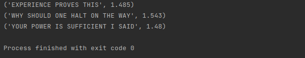

# *Speech-to-Text Module Code*

The following code implements a threaded and multiprocessing queue system that 
handles the task of converting audio-files to text.

## *Code Organization*

- `python/processing.py` :  Example code for multiprocessing vs. threading.
- `python/speech2text.py` : Speech to text module. Uses an access-key to run a local
model that converts the audio to text. In this code, I selected picovoice leopard over
Deepspeech and Google ASR because of the small size of the model, and it provides up to 100hrs
of free use per month without the need for credit card information.
- `/data` : Includes the audio text data.
- `/test` : Unit testing for the modules.
- `requirements.txt` : Lists all the libraries(with version) needed to successfully
run the code in a virtual environment.

## *API Documentation*

- `speech2txt(audiolist:list)` Performs the speech-to-text conversion. It takes in a list containing 
the audio files to be processed and generates queue system and threads to complete the 
task. As mentioned before, I utilized picovoice in this example. For each thread, a
new instance of the model is generated to handle the audio. Since the models are very
small (<20MB), this is not a huge issue.

## *Results*

- Example of speech-to-text module running on text audio. The audio files
were translated perfectly.

>
